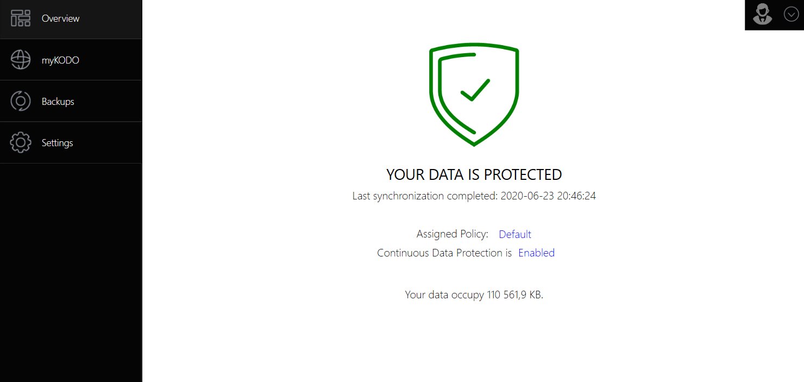

# KODO For Endpoint Client

KODO for Endpoint Client is a next-generation solution, using Continuous Data Protection \(CDP\) for endpoint users with MS Windows and MacOS. KODO is a comprehensive protection of any information and is able to provide the most optimal and secure access to corporate/private data. Endpoint Protection has become an essential element not only for employees but also for those managing the enterprise in order to protect sensitive and critical data of the organization. KODO for desktop has critical and unique features that correspond to issues tackled in any organization:

* Continuous data protection \(CDP\) 
* Incremental backup
* Versioning protected objects
* Self-Restore - intuitive data restore
* Data availability anywhere/anytime
* Ability to recover data from a particular point in time
* Privacy Policy, integration with IBM Spectrum Protect.

On this screen you will see basic information about client settings and backup status.

1. Protection status and last backup time
2. Assigned Policy
3. Continuous Data protection status
4. Amount of backup. 


You can pause KODO client just by clicking "Enabled" and selecting wanted option.


