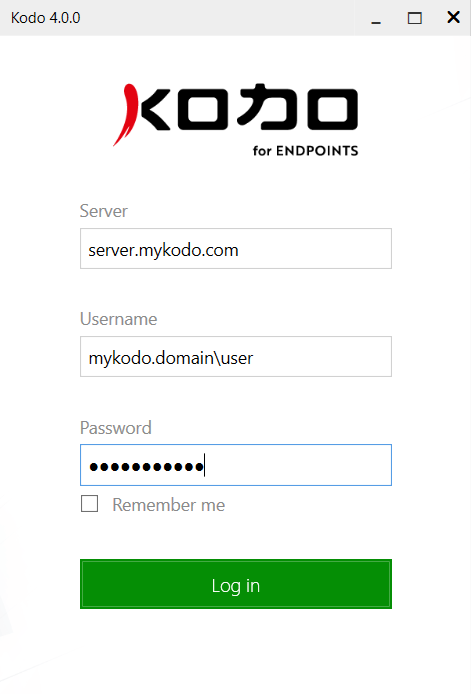
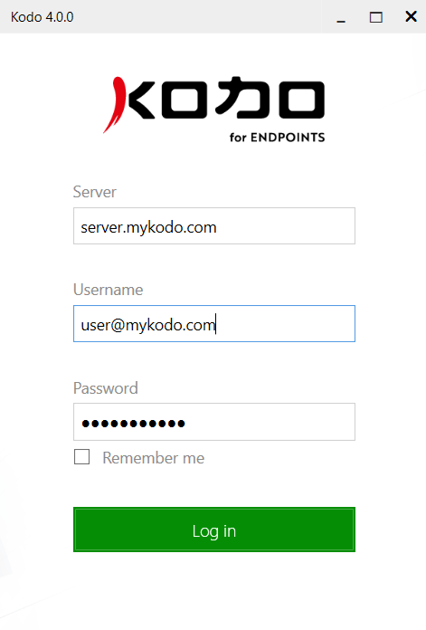

# Installation

Download an installation package as described in the [**Deployment**](../management/client-deployment/) section.


If there was a previous installation of KODO for Endpoints, the total content of **C:\ProgramData\Storware\Kodo** should be removed before installation!


**Domain user**

In order to use the application, the user must be logged in, activated and perform the first full backup. In order to do this, run the application for the first time, and fulfill the following configuration fields: "**Server**" enter the server address of your organization. In the field "**Username**" enter the user name as "_domain\username_". In the "**Password**" enter the password, which is used as the password for e-mail, and click "**Log in**". If the server at that address does not start or the address is incorrect, the user will see a message.

**Standalone user**

The user will be asked to enter the following information: 

1. **Server** - KODO for Endpoint server address 

2. **Username** - Client Username 

3. **Password** - Password

After fulfilling these fields just click the "**Log in**" button.


After installation and log in the process of securing the files in the selected locations will begin automatically according to the assigned policy.


