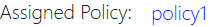
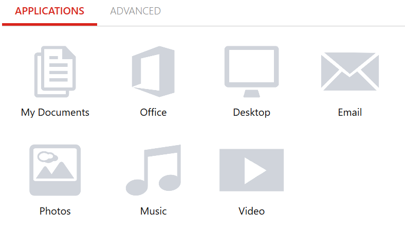
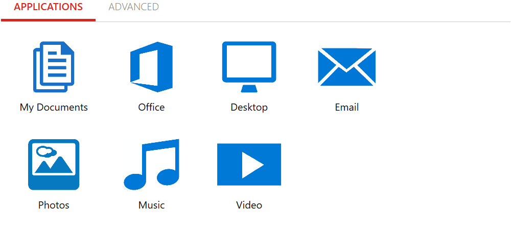
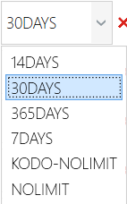
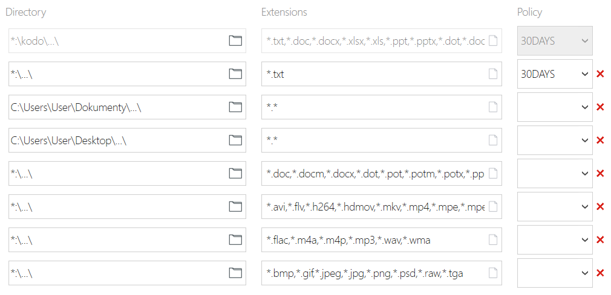
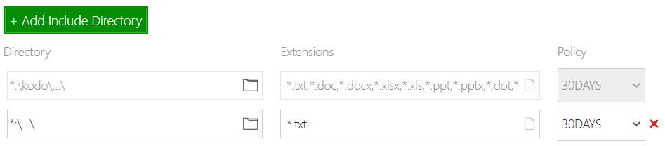

## Policy edit
User can change policy settings assigned to endpoint if organization admininistrator allowed it in policy settings.
To check or edit assigned policy just click the name of policy on it on dashboard.
In example "policy1"

For quick assigning just click proper document type in "Applications" bar

* Select "My Documents" to add "My Documents" folder and subfolders to backup, ie. "C:\Users\user\Documents\...\"

* Selecting "Office" will add all office type documents(doc,docm,docx,dot,pot,potm,potx,ppam,pps,ppsm,ppsx,ppt,pptm,pptx,sldm,sldx,xla,xlam,xlm,xls,xlsb,xlsm,xlsx,xlt,xltx,xlw)
on every disk on system.

* Select "Desktop" to add desktop folder and all subfolders on it to backup
* Select "Email" to add and schedule mailbox files for backup. **MS Outlook** and **IBM Notes and Domino** are supported only.
* By selecting "Photos" you will add all graphic files (bmp,gif,jpeg,jpg,png,psd,raw,tga) on all disks to backup.
* "Music" will add most common audio format files (flac,m4a,m4p,mp3,wav,wma) on all disks to backup
* To simply add all video files format (avi,flv,h264,hdmov,mkv,mp4,mpe,mpeg,mpeg1,mpeg4,mpg,mpg2,wmv,xvid) just select "Video" icon.

Selected items will change colour to blue.

On Advanced tab You have to select retention for every directory added for backup.
Just roll out "Policy" menu on the right of item.

There are retention options to choose: 7Days,14Days,30Days,365Days and Nolimit.

You can add directory manually to backup by clicking 

and fulfilling _Directory_, _Extension_ and retention _Policy_ fields.

For exclude some directories or/and file formats from backup just choose

 button.

