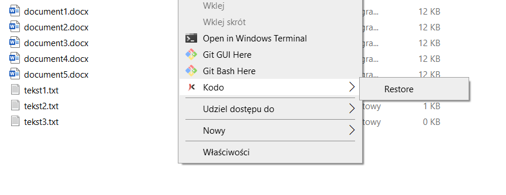
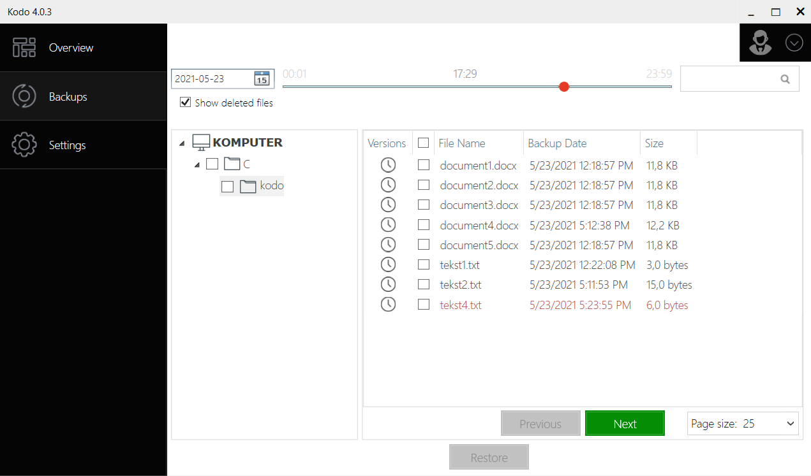
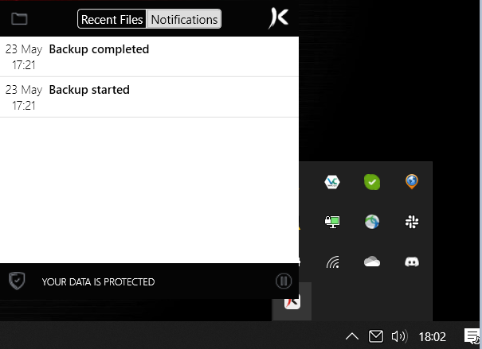
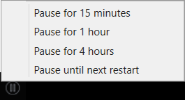
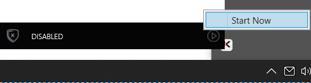

# Right Mouse Button

Right mouse button is very useful tool using with KODO client.

You can restore file after deletion, restore file after every change and pause KODO client. 
## Point in time restore
Because of Continuous Data Protection every file in selected directory will be backed up just after any change.
This allows You to restore file before every change made within retention period.
To do this just click right mouse button on selected file and choose backup from selected time:

## Restore previously deleted file

You can restore deleted file just by clicking right mouse button in directory that file was located 

and choose _Restore_ option. This will open GUI when You can restore deleted file from previous backup by checking box **Show deleted files**

All deleted files are displayed in red colour. You can choose proper file and restore it as in [**UI usage**](ui.md) section.

## Pause KODO client.

You can pause client, ie. when on mobile connection.
To do this You have to find KODO icon in notification area on Windows toolbar and click right mouse button on it:

 

Then click Pause button  and select proper value from menu.
You can pause client for 15 mins, 1 hour, 4 hours or till next system restart.

 
 
 You can always start back by clicking right mouse button on KODO icon in notification area and selecting  button and then _Start Now_ 
 
 