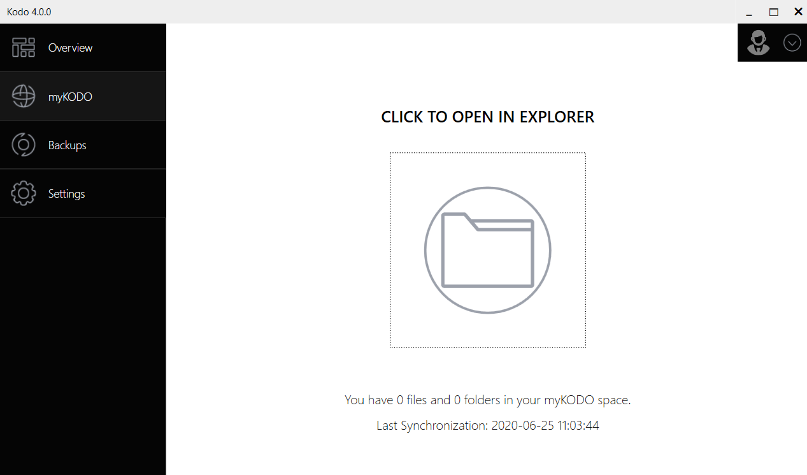
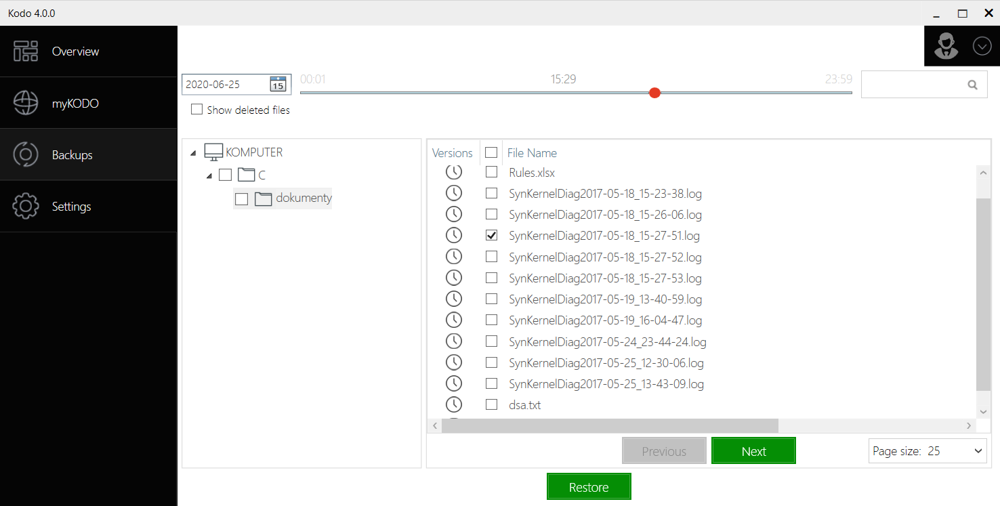
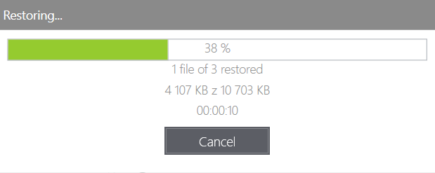
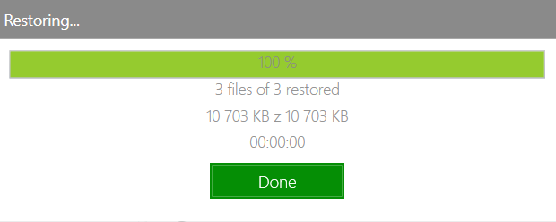
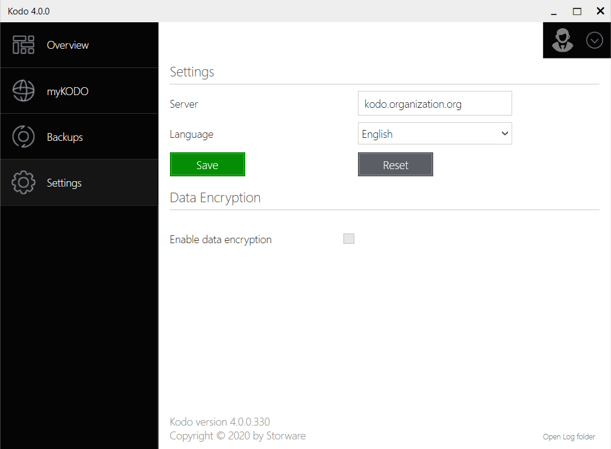

# KODO for Endpoind Client using guide.

## Overview

On this screen you will see basic information about client settings and backup status.

1. Protection status and last backup time
2. Assigned Policy
3. Continuous Data protection status
4. Amount of backup

## MyKODO

MyKODO allows You to share files within organization.
All shared data will be protected by KODO for Endpoint.

## Backups

On this tab you can perform restore of files from previous backups.

To restore file or files, just select day and time of backup on upper left corner

and then select directory and/or file(s) to restore. You can restore whole directories instead of individual files too by checking up directories. After selection just click __Restore__ button and choose destination of restore.

After all click one more time __Restore__ button.

If there is conflict with existing file, you have to choose an action:

* _Overwrite_ - to overwrite all existing files that conflict with restore
* _Skip_ - to skip restore of all conflicting files
* _Decide for each file_ - decide what to do on every restored file
* _Cancel_ - for cancel operation.

You can cancel unfinished operation by clicking __Cancel__ button.

After all just click __Done__.

Restore process is finalized.

## Settings
On Settings tab you can change server settings, interface language and turn on or off data encryption.

After changing values just click __Save__ button. 

To restore previous values click __Reset__ button.

On this tab You can open logs folder for troubleshooting by clicking "_Open Log folder_" on bottom right corner.

