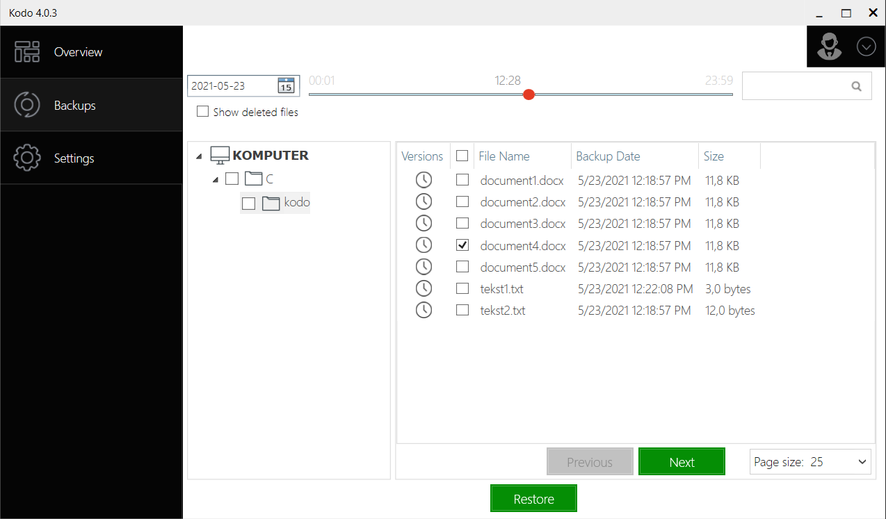
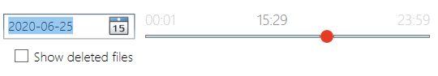
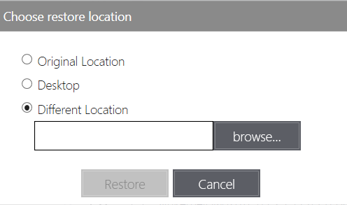
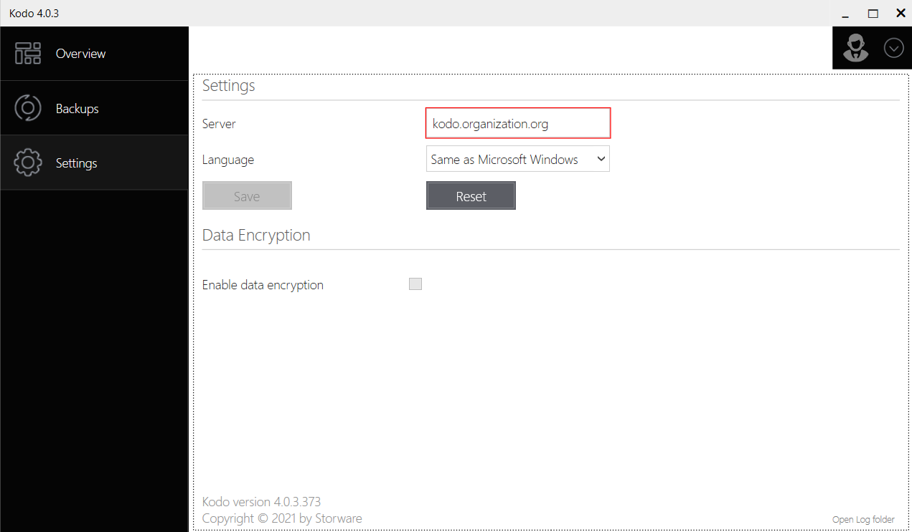
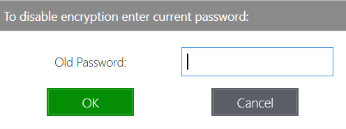

# Client Dashboard

## Backups


Warning, Kodo For Endpoint will not backup zero size files!


On this tab you can perform restore of files from previous backups.

To restore file or files, just select day and time of backup on upper left corner

and then select directory and/or file\(s\) to restore. You can restore whole directories instead of individual files too by checking up directories. After selection just click **Restore** button and choose destination of restore.

After all click one more time **Restore** button.

If there is conflict with existing file, you have to choose an action:

* _Overwrite_ - to overwrite all existing files that conflict with restore
* _Skip_ - to skip restore of all conflicting files
* _Decide for each file_ - decide what to do on every restored file
* _Cancel_ - for cancel operation.

Operation may be canceled by clicking **Cancel** button.

After all just click **Done**.

Restore process is finalized.

## Settings

On Settings tab you can change server settings, interface language and turn on or off data encryption.

After changing values just click **Save** button.

To restore previous values click **Reset** button.

On this tab You can open logs folder for troubleshooting by clicking "_Open Log folder_" on bottom right corner.

* To enable data encryption just check the box and confirm the warning message.


Enabling or disabling of encryption will erase all previously created backups!


And set encryption password.

After that backup will be encrypted.

* To disable encryption just unselect the checkbox, confirm the warning message and provide a previously set password.

