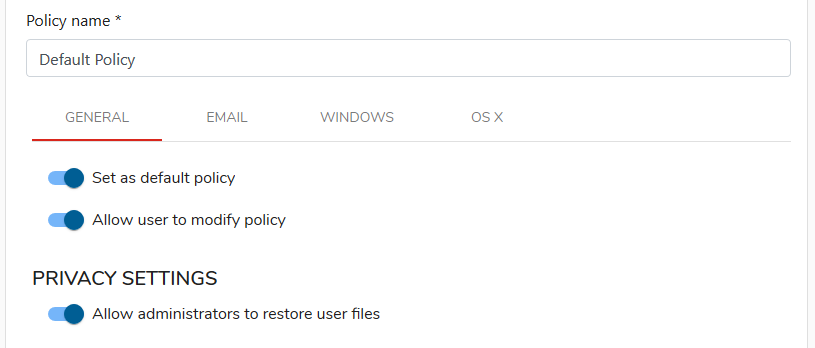
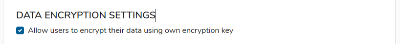

# General settings

## BASIC SETTINGS 

**Set as default policy** Set policy as a default for newly synchronized users

**Allow user to modify policy** User can add new objects to protect - modification will only concern a user device where the modification has been made, server settings will be not changed

## **PRIVACY SETTINGS** 

**Allow admin to restore user files** Allow administrator to restore user files directly to his workstation.

## **PASSWORD SETTINGS** 

Password requirements for local users accounts:

* **Minimal password length**
* **Require lowercase letters**
* **Require uppercase letters**
* **Require both letters and numbers**
* **Require special characters**

## **RISK NOTIFICATION SETTINGS** 

**Send email notification for unprotected desktops** If desktop device will change status to unprotect, device owner will be notified by e-mail

**Show desktop as "Unprotected" after specified period since last backup \[day\]** Number of days, without any contact from desktop device, after which status will be changed to unprotected

## ENCRYPTION SETTINGS 

**Allow users to encrypt their data using their own encryption key** Allow user to turn on client-side data encryption. Data are encrypted using key based on password provided by user. Encrypted data can't be restored by administrator.

