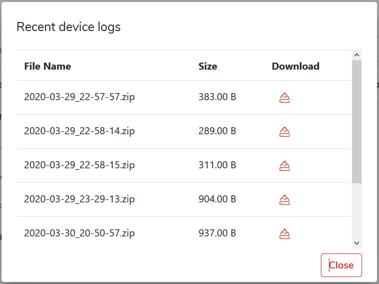

# Device logs

To download the device logs, select `Devices` from the main menu and then click the arrow to the right of the table on the line with the device whose data you want to display select `Logs` from the `Options` menu.

Download the selected log file from the available list by clicking on the blue download icon.

_**Hint:**_ _Log are compressed zip files, the file name is constructed as follows: sentDate\_sentTime.zip_

