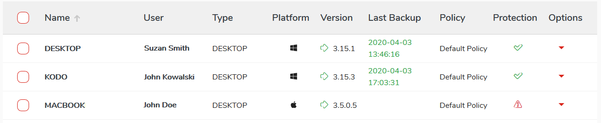

# Devices list

## List registered devices 

A list of devices is a collection of all registered and protected devices in the system.

To view the list of registered devices, select `Devices` from the main menu.

Devices list table view consist of following columns:

* **Name** Registered device name
* **User** Name of the device owner
* **Platform** The type of operating system platform represented by an icon
* **Version** Version of the application installed on the device
* **Last Backup** Date of last device backup
* **Policy** Protection policy assigned to the user
* **Protection** Current protection status.
* **Options** Quick action menu

| **Field** | **Description** |
| :--- | :--- |
| Name | Registered device name |
| User | Device ower |
| Platform | Device operating system |
| Version | Version of installed KODO client |
| Last backup | Last device backup data and time |
| Policy | Assigned protection policy |
| Protection | Device protection status \(see table below\) |
| Options | Quick action menu |

## Protection statuses 

| **Status** | **Description** |
| :--- | :--- |
| Protected  | Device is protected according to assigned policy |
| Not protected  | Device didn't connect with server within last days. Number of days is configured by policy, |
| Locked  | Device is locked. User cannot log in and perform any operations from this device. |

