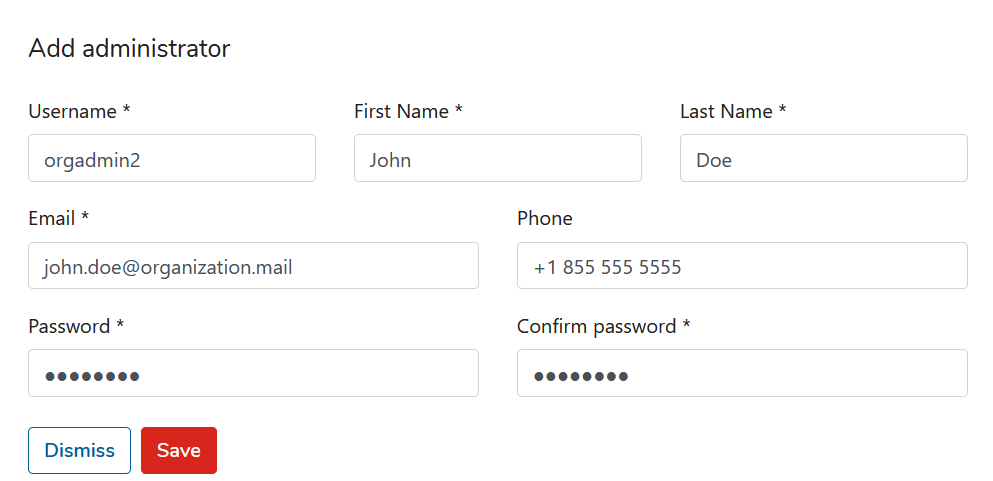
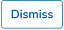
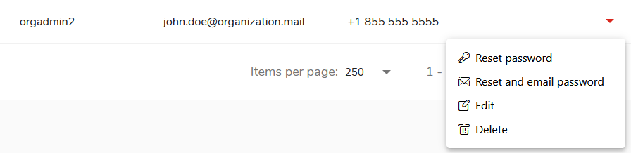
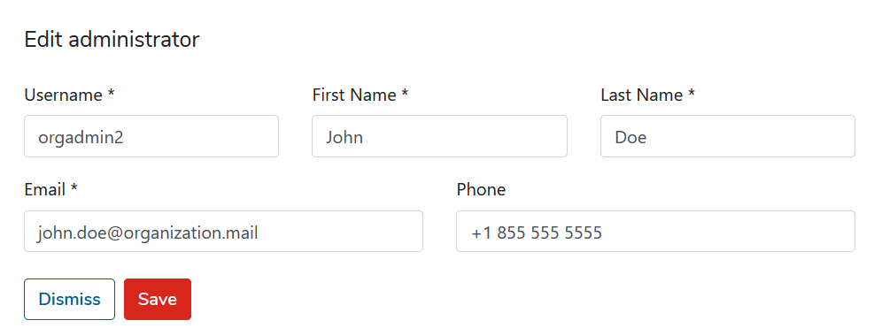
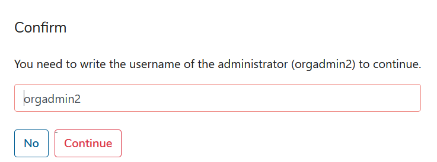
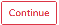
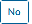
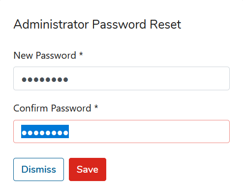
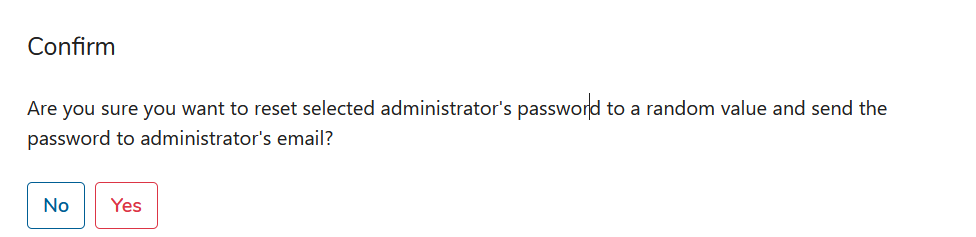

# Administrators

There are two tabs in Administrator section. **_Kodo Organization Administrators_** and **_Kodo Portal Administrators_**

In **_Kodo Organization Administrators_** tab you can Add/Change/Remove administrator accounts for Your organization.

* ### Adding new organization administrator account

Click  and fill all fields with data of new organization admin.

and then click  to add new account or  to cancel.

* ### Changing existing organization administrator account

To change existing administrator account data just click drop-down menu on the right side of administrator user and click _**Edit**_

In opened window you can change username, name, email and phone number.

After editing an user just click  to save changes or  to cancel.

* ### Removing organization administrator account

To remove account you have to click drop-down menu on the right side of user in table

 and select _**Delete**_

To confirm selection write username for deletion.

and choose  or  for cancel.

* ### Resetting password for organization administrator account

To reset password for organization administrator just click drop-down menu and choose _**Reset password**_ for manual password set,

and choose  or  for cancel.

Another way to change password is _**Reset and email password**_ for automatic password generation. Generated password will be sent to email provided for account.

Choose  or  for cancel.