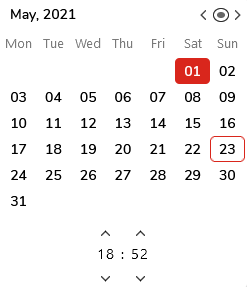
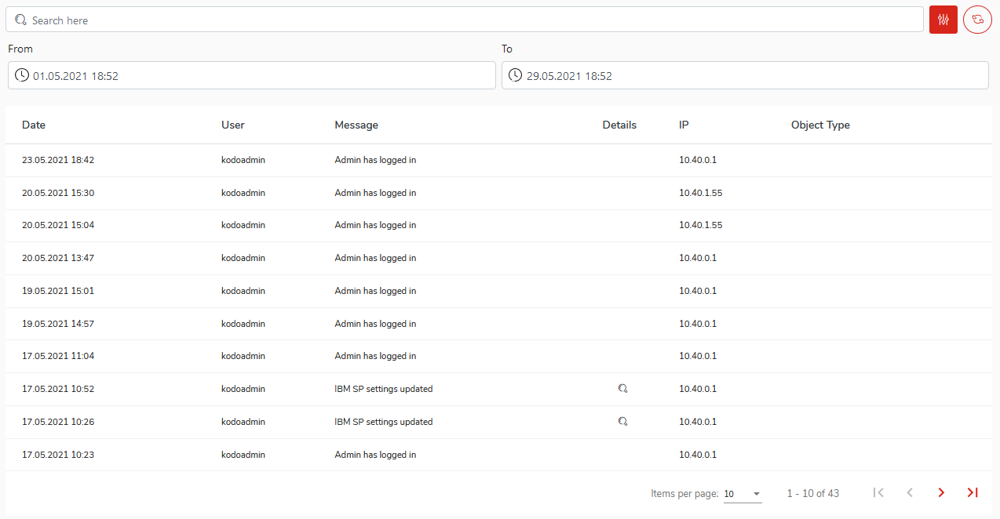

# Audit log

The audit log tab allows showing every event triggered by the kodoadmin user such as login or change settings. To select the date range of logs just click the filter icon and select a time period \(FROM and TO sections\) from the calendar menu.

As a result, you will receive a view of all events within the selected time period.

Go to the [Settings ](settings.md)chapter to find out more about the system settings. 

