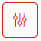

## Audit log

Audit log tab allows show every event triggered by kodoadmin user such login, change settings.
To select date range of logs just click  and select 
FROM and TO sections from callendar menu.

In result You will receive view of all events within selected range.

