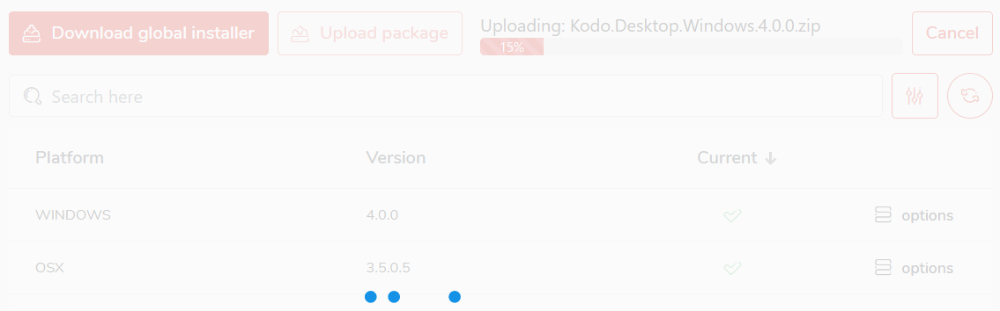

# Deployment

To upload client packages to your KODO Server follow the steps:

1. Click **Deployment** located in the left menu, this will move you to KODO deployemnt page
2. Click **Upload package** button, select client package and click **Open**
3. After successful upload information will be displayed

Packages selected as "current" will determine production package version for the server instance.

