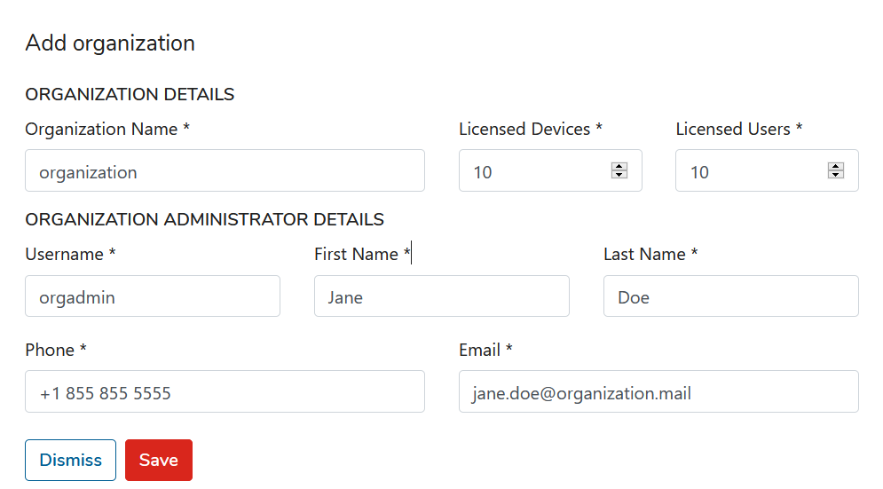

# Organizations

This menu item allows you to add/edit/remove organizations in KODO for Endpoints.

## **Add Organization**
To add new organization just click  and fill all fields:

After all click  to add organization or  to cancel.

## **Edit Organization**
Edit Organization data allows you to set additional settings:

* **ORGANIZATION DETAILS**

* **GENERAL SETTINGS**

* **SECURITY SETTINGS**

* **SERVICE PROVIDER SETTINGS**

## Delete Organization