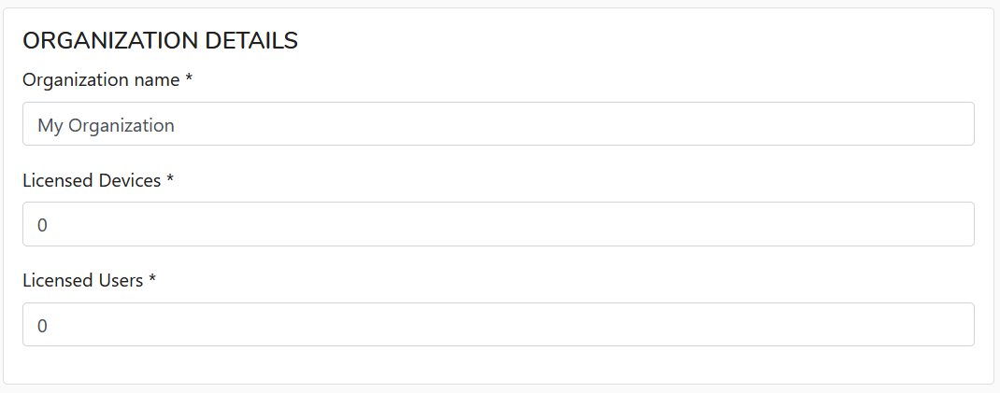
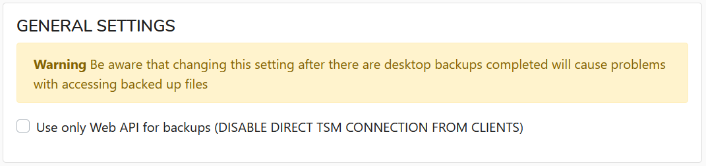
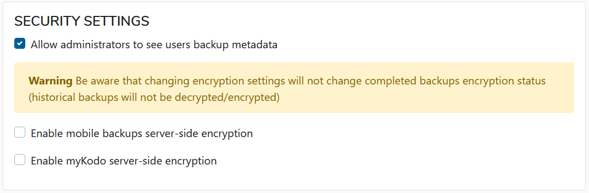
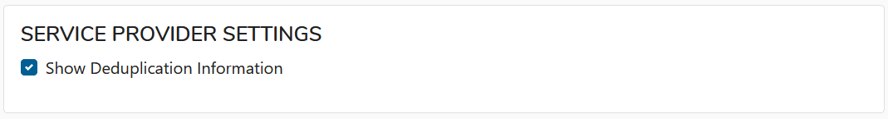

# Organizations

This menu item allows you to add/edit/remove organizations in KODO for Endpoints.

## **Add Organization**

To add new organization just click  and fill all fields: 

After all click  to add organization or  to cancel.

## **Edit Organization**

Edit Organization data allows you to set additional settings:

* **ORGANIZATION DETAILS**

In this section you can change organization name, number of licensed devices or users.

* **GENERAL SETTINGS** In General Settings section you can enable/disable direct connection from client. Default 
* **SECURITY SETTINGS**

* **SERVICE PROVIDER SETTINGS**

After modification of any of previous fields just click  or  for discard any changes.

## Delete Organization

