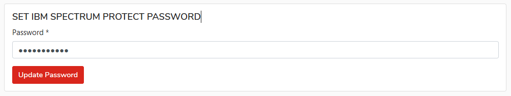

# Settings

To change configuration select `Settings` from the top portal bar.

### **GENERAL**

This section allows you to configure domain name for URL with deployment package:

_Link will be sent in format:_ **https://deployment.server.name/TOKEN**

Yo can narrow access for kodoadmin to specific IP addresses.

Confirm the settings with the `SAVE` button

### Email

In this section you will configure smtp server settings for KODO for Endpoint.

You must set sender email address, server address and ports settings.

You can set login name when server needs authentication.

When authentication is required then you have to set email server password.

### IBM Spectrum Protect \(TSM\) setup

**NOTE: If you are using KODO Virtual Appliance change "Server address" configuration. "Server address" should point to KODO server IP address that will be available for backup clients! For Virtual Appliance no further changes are required.**

To set up connection with backup server:

1. Click **Settings** located in top bar, this will move you to KODO configuration page
2. Click **Spectrum Protect** tab.
3. Provide all necessary Spectrum Protect server settings:
   * **Server address** – IP/DNS name of Spectrum Protect Server
   * **Port** – Spectrum Protect client port
   * **Adminitrative port** – Spectrum Protect Administrative port \(if different from client port\)
   * **Nodename** – nodname used by KODO \(created in [previous steps](../deployment/spectrum-protect-tsm-configuration.md)\)

     
4. Click **SAVE CHANGES** button.
5. Provide password for node in “SET IBM SP PASSWORD” section

     

6. Click **UPDATE PASSWORD** button

### License registration

After installation or Virtual Appliance deployment KODO Server is running in TRIAL mode for 30 days. After that time you need to provide valid license key.

To get a license key please contact with our local [partner](https://storware.eu/en/partners/) or [Storware](mailto:info@storware.eu) team.

If you already have a valid license key please follow the steps:

1. Click **Settings** located in top bar, this will move you to KODO configuration page
2. Click **License** tab.
3. Provide your license key in **Update your Kodo license key** field
4. Click **UPDATE LICENSE** button

### Logs

In this tab you can set all parameters for KODO for Endpoints server logs.

1. Click **Settings** located in top bar, this will move you to KODO configuration page
2. Click **Logs** tab. 
3. Provide max number of logs files, log level, max size of single file and set retentions period in days.
4. Click **Save** to apply settings.

You can download and view server logs as well.

### Billing

In this section you can assign client licenses to users and set billing period retention.
