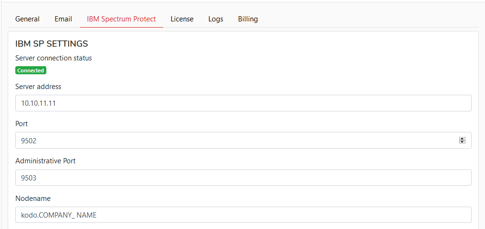

# Settings

## Settings

To change configuration select `Settings` from the top portal bar.

### **GENERAL**

This section allows you to configure domain name for URL with deployment package: 

_Link will be sent in format:_ [https://deployment.server.name/TOKEN](https://deployment.server.name/TOKEN)

You can narrow access for kodoadmin to specific IP addresses.

Confirm the settings with the  button

### Email

In this section you will configure smtp server settings for KODO for Endpoint.

To set up **e-mail** server:

1. Click **Settings** located in top bar, this will move you to KODO configuration page
2. Click **General** tab.
3. Provide the necessary information for the e-mail server configuration

   * **E-mail address** – address used to sending e-mails from KODO
   * **Login** – user name used to login to e-mail server \(optional if server needs authentication\)
   * **Server address** - IP or DNS name of the e-mail server
   * **Port** - port of the e-mail server
   * **Use SSL** - set to "on" if SSL communication is required
   * **SSL Port** - TCP Port number used by SSL SMTP server
   * **Require Authentication** - set to “on” if server requires authentication

   

4. Click  button.
5. If server needs authetication then provide password for e-mail server in **SET EMAIL SERVER PASSWORD** section

   

6. Click “UPDATE PASSWORD” button

_TIP: You can test your configuration click **SEND TEST EMAIL** button_

After installation and configuration SSL components for Spectrum Protect Server described in [IBM Spectrum Protect engine](https://github.com/Storware/kodo-endpoints-manual/tree/48a0e77771612de33ae0394056835a6d98a068de/configuration/deployment/ibm-spectrum-protect/README.md) you can configure SSL settings in KODO Admin portal tab.

## Configuring SSL connection with Spectrum Protect \(TSM\)

To use SSL connection between KODO Server, Desktop clients, and Spectrum Protect \(TSM\) server you need to upload correct SP \(TSM\) certificate. This certificate will be used by server, and also will be distributed to all KODO for Desktop clients and used with SSL connection between client a backup server.

If you already have a valid certificate file please follow the steps:

1. Click **Settings** located in top bar, this will move you to KODO configuration page
2. Click **IBM Spectrum Protect** tab.
3. Click **Upload certificate** button and select the valid SP \(TSM\) certificate file

1. Set to "on" **Use SSL** switch

### IBM Spectrum Protect \(TSM\) setup

**NOTE: If you are using KODO Virtual Appliance change "Server address" configuration. "Server address" should point to KODO server IP address that will be available for backup clients! For Virtual Appliance no further changes are required.**

To set up connection with backup server:

1. Click **Settings** located in top bar, this will move you to KODO configuration page
2. Click **Spectrum Protect** tab.
3. Provide all necessary Spectrum Protect server settings:
   * **Server address** – IP/DNS name of Spectrum Protect Server
   * **Port** – Spectrum Protect client port
   * **Adminitrative port** – Spectrum Protect Administrative port \(if different from client port\)
   * **Nodename** – nodname used by KODO \(created in [previous steps](https://github.com/Storware/kodo-endpoints-manual/tree/48a0e77771612de33ae0394056835a6d98a068de/configuration/deployment/spectrum-protect-tsm-configuration.md)\)

     
4. Click  button.
5. Provide password for node in “SET IBM SP PASSWORD” section

   

6. Click **UPDATE PASSWORD** button

### License registration

After installation or Virtual Appliance deployment KODO Server is running in TRIAL mode for 30 days. After that time you need to provide valid license key.

To get a license key please contact with our local [partner](https://storware.eu/en/partners/) or [Storware](mailto:info@storware.eu) team.

If you already have a valid license key please follow the steps:

1. Click **Settings** located in top bar, this will move you to KODO configuration page
2. Click **License** tab.
3. Provide your license key in **Update your Kodo license key** field
4. Click **UPDATE LICENSE** button

### Logs

In this tab you can set all parameters for KODO for Endpoints server logs.

1. Click **Settings** located in top bar, this will move you to KODO configuration page
2. Click **Logs** tab. 
3. Provide max number of logs files, log level, max size of single file and set retentions period in days.
4. Click  to apply settings.

You can download and view server logs as well.

### Billing

In this section you can assign client licenses to users and set billing period retention.

