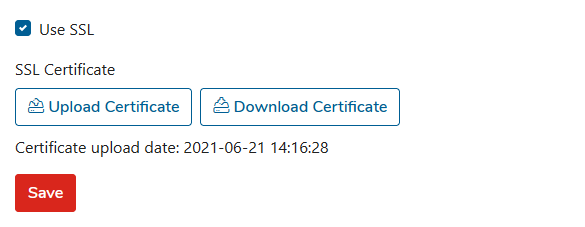

# Settings

## Settings

To change configuration settings select the **Settings** menu from the left pane and switch to the apropriate tabs.

### **GENERAL tab**

This section allows you some mail server settings. 

#### General settings

In this section, you can configure the deployment server name and also enter the IP addresses allowed to connect to the server. 


The deployment link will be sent in the format: [https://deployment.server.name/TOKEN](https://deployment.server.name/TOKEN)


Confirm the settings with the **Save** button.

#### Customizations

In this section, you can configure the URLs to the support, product, and documentation website.

#### Staging Settings

In this section, you can configure a path to the staging directory that is used as temporary disk space for restored files \(see the [Restore Jobs](../kodo-organization-portal/restore-jobs.md) section\).  

### Email tab

In this section, you can configure access to SMPT as a relay to send e-mail messages from the KODO server to the defined recipients.

To set up an **e-mail** server:

1. Click the **Settings** located in the top bar, this will move you to the KODO configuration page
2. Click the **General** tab.

   1. Provide the necessary information for the e-mail server configuration
      * **E-mail address** – address used to sending e-mails from KODO
      * **Login** – user name used to login to e-mail server \(optional if the server requires authentication\)
      * **Server address** - IP or DNS name of the e-mail server
      * **Port** - port of the e-mail server
      * **Use SSL** - check it  "**on**" if SSL communication is required
      * **SSL Port** - TCP Port number used by the SSL SMTP server
      * **Require Authentication** - set to “**on**” if the server requires authentication

    

3. Click the **Save** button to apply changes.
4. If the server requires authentication then provide a password in the **SET EMAIL SERVER PASSWORD** section.

   

5. Click the **UPDATE PASSWORD** button to save the password.


_TIP: You can test your configuration click **SEND TEST EMAIL** button_


### IBM Spectrum Protect tab


**NOTE:** If you are using KODO virtual appliance, please change the **Server address** configuration. the **Server address** value should point to the KODO server IP address that will be available for backup clients. For a virtual appliance, no further changes are required.


To set up a connection with the backup server:

1. Go to the **Settings** menu.
2. Click the **IBM** **Spectrum Protect** tab.
3. Enter all required **IBM** Spectrum Protect server settings:
   * **Server address** – IP/DNS name of Spectrum Protect Server
   * **Port** – Spectrum Protect client port
   * **Administrative port** – Spectrum Protect Administrative port \(if different from client port\)
   * **Nodename** – a nodname used by KODO.

     
4. Click the **Save** button.
5. Provide a password for node in **SET IBM SP PASSWORD** section

   

6. Click the **UPDATE PASSWORD** button

To use the SSL connection between KODO Server, desktop clients, and IBM Spectrum Protect server,  you have to upload the correct SP certificate. This certificate will be used by the server, and also will be distributed to all KODO for Endpoints clients and used with the SSL connection between the client and the backup server.

If you already have a valid certificate file please follow the steps:

1. Go to the **Settings** menu.
2. Click the **IBM Spectrum Protect** tab.
3. Click the **Upload certificate** button and select the valid SP certificate file.

    

4. Check the **Use SSL** option.
5. Click the **Save** button to apply changes.

### License tab

After installation or virtual appliance deployment, KODO Server is running in TRIAL mode for 30 days. After that time you need to provide a valid license key. __To get a license key please contact our [Storware sales team](mailto:globalsales@storware.eu).

If you already have a valid license key please follow the steps:

1. Go to the **Settings** menu.
2. Click the **License** tab.
3. Click the **Upload license** button.
4. Select a license file.
5. Click the **Open** button to upload the license.

### Logs tab

In this tab, you can set all parameters for KODO for Endpoints server logs.

1. Click the **Settings** menu. 
2. Provide max number of log files, log level \(TRACE, DEBUG, INFO\), max size of a single file, and set retention period in days.
3. Click the  **Save** to apply changes.

You can download and view server logs as well.

### Billing tab

In this section, you can assign client licenses to users and set billing period retention. This information is used by kodoadmin to charge all defined organizations in KODO for Endpoints server separately.

