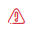

# Device status

Each device registered in the system has a suitable status defining its current state. Possible device status in the system are presented in the table below:

<table>
  <thead>
    <tr>
      <th style="text-align:left">Status</th>
      <th style="text-align:left">Description</th>
    </tr>
  </thead>
  <tbody>
    <tr>
      <td style="text-align:left">
        

        
<b>Protected</b> 
          
        

      </td>
      <td style="text-align:left">The status is presented with a green V symbol. This indicates that the
        device is active and that the device&apos;s last communication time did
        not exceed the value given in the policy assigned to the device owner.</td>
    </tr>
    <tr>
      <td style="text-align:left">
        

        
<b>Not protected</b> 
          
        

      </td>
      <td style="text-align:left">The status is represented by the red triangle icon. This indicates that
        the device is active, but the last communication time of the device has
        exceeded the value specified in the policy assigned to the device owner.</td>
    </tr>
    <tr>
      <td style="text-align:left"><b>Locked</b> 
        
      </td>
      <td style="text-align:left">The status is presented with a red padlock icon. This indicates that the
        device is locked and the backup or restore operations cannot be performed.</td>
    </tr>
    <tr>
      <td style="text-align:left"><b>Archived  </b>
        
      </td>
      <td style="text-align:left">The status is presented with a gray suitcase. This indicates that the
        device is archived and only restore operations can be performed.</td>
    </tr>
  </tbody>
</table>

