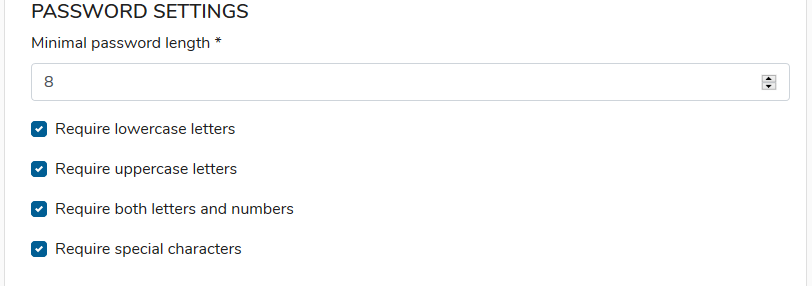
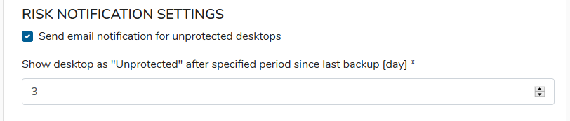

# GENERAL tab

In the General tab you have the following option to set:

* **Set as default policy** -Set policy as a default for newly synchronized users
* **Allow user to modify policy** - User can add new objects to protect - modification will only concern a user device where the modification has been made, server settings will be not changed.

## **PRIVACY SETTINGS** 

* **Allow admin to restore user files** **-**Allow administrator to restore user files directly to his workstation.

## **PASSWORD SETTINGS** 

Password requirements for local users accounts:

* **Minimal password length**
* **Require lowercase letters**
* **Require uppercase letters**
* **Require both letters and numbers**
* **Require special characters**

## **RISK NOTIFICATION SETTINGS** 

* **Send email notification for unprotected desktops** - If the device will change status to unprotect, the device owner will be notified by e-mail**.**
* **Show desktop as "Unprotected" after specified period since the last backup \[day\]** - Number of days, without any contact from a desktop device, after which status will be changed to unprotected

## DATA ENCRYPTION SETTINGS 

* **Show desktop as "Unprotected" after specified period since the last backup \[day\]** - Number of days, without any contact from a desktop device, after which status will be changed to unprotected
* **Allow users to encrypt their data using their own encryption key** -Allow users to turn on the client-side data encryption. Data are encrypted using a key based on the password provided by a user. Encrypted data can't be restored by the administrator.

