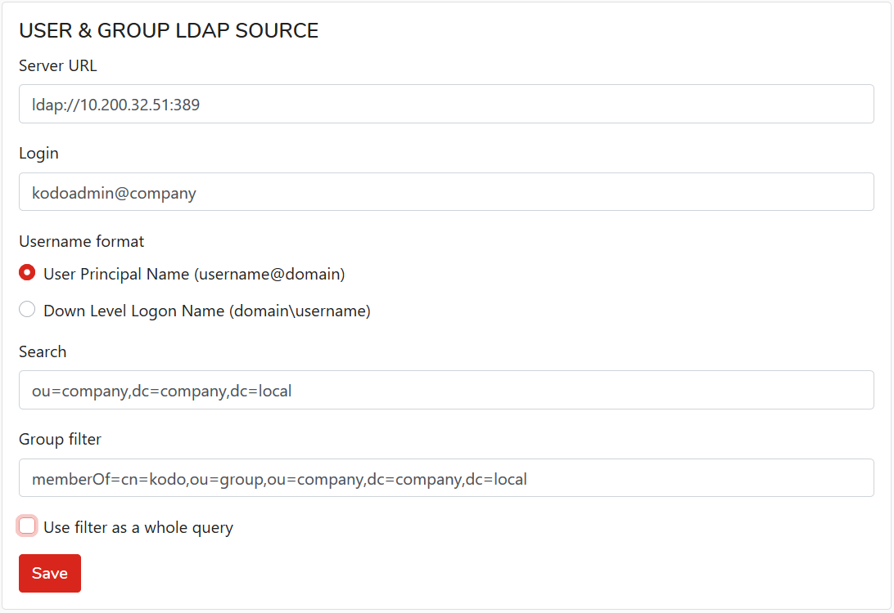

# Settings

In the **Settings** view, you can configure the main organization settings.

## General tab

### **USAGE & ACTIVITY REPORT**

This section allows you to configure reports about space usage and device activity

**Send reports every \(days\)**  
The interval with which the reports are sent.

**Send reports to emails**  
The email addresses to which the report should be sent. Multiple email addresses can be provided \(comma separated\).

**Send report time**  
Time at which the report should be sent.

**Unprotected devices notification time**  
Time at which the report should be sent.

Confirm and save the settings with the **Save** button.

## Administrators tab

In this tab, you can list and manage your organization's administrators. If you need to add another organization admin, click the **Add Administrator** button.

Provide all required information to create the new administrator.

In the **Options** menu, you have the following options to choose from:

* **Reset password**  - to reset administrator's password
* **Edit** - to change the administrator's details like username, email address or phone number
* **Delete**- to remove the administrator account you have to type in his name in the confirmation window. 

## LDAP tab

The LDAP configuration is described in the [Sync users with LDAP](settings.md) chapter.

Before you begin the LDAP server configuration with KODO Organization Admin Portal, on the LDAP server you have to prepare the following resources:

1. A user group \(you can name it e.g: **KODO** to be easy associated with the KODO for Endpoints server.
2. Create a user account \(or use the one you have on your LDAP server, the account does not need to have any special privileges\)
3. Assign the users to the group you've created.

To configure connection LDAP server with KODO Organization Admin Portal, to as follow:

1. Enter the LDAP server name or IP address.
2. Enter the login \(the user name in the format i.e.: username@domainname\)
3. Choose the username format
4. Set the **Search** option ****\(directory service search filter\) in the format: ou=X,dc=X, dc=X, where:
   * `OU` = Organizational Unit
   * `DC` = Domain Component
5. Set the **Group filter** option \(LDAP group filter\) in the format: memberOf=cn=X,ou=X,ou=X, dc=X dc=X, where: 
   * `CN` = Common Name
   * `OU` = Organizational Unit
   * `DC` = Domain Component
6. Optionally, you can check the **User filter as a whole query** option.


If you configuring synchronization for the first time before clicking the **Save** button fill the LDAP user password fields.


Click on the **Save** button to confirm your changes.

## User Synchroziation tab

Here you can configure the source of user synchronization from an external source.

**Source type**  
Source of user synchronization:

* **NONE** - no synchronization with external
* **LDAP** - users synchronization with LDAP service

**Auto synchronize users**  
User synchronization will be performed automatically according to configured frequency \(see below\)

**Auto synchronization frequency \(minutes\)**  
Every how many minutes automatic users synchronization will be performed.

## NOTIFICATIONS

Here you can configure support for users' SMS notifications about unprotected devices.

**SMS Notification Provider**  
Here you can choose a communication way with your SMS gateway. At this moment only e-mail communication is supported.

**Phone number digits to include in notification address \(from the end\)**  
Phone number is taken from user profile \(_TELEPHONE_ field\). Here you can configure how many digits, counting from the end, should be used to create an e-mail message template. Use "**0**" digit to not trim the phone number at all.

**Address Construction Template**  
User variables to build "**from**" template e-mail address that will be used to communicate with SMS gateway. You can use the following variables:

* **%PHONE%** - user phone number will be used instead

Example:  
_Address Construction Template: %PHONE%@example-sms-gateway.com  
E-mail from the address: 123420123@example-sms-gateway.com_

## 

