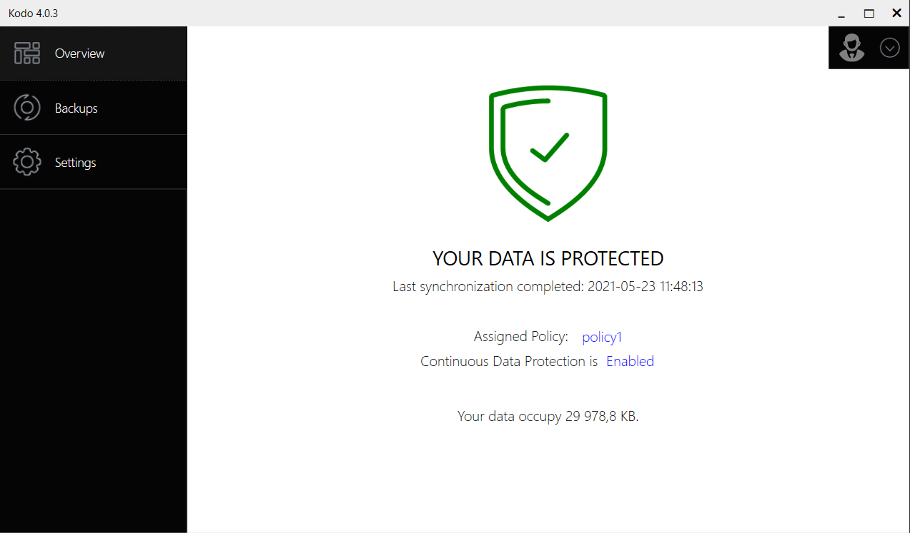

# Using KODO for Endpoint client

KODO for Endpoints client is an application dedicated to backup and restore data from client devices \(laptop/desktops\) running Windows and macOS operating systems.


MacOS client is currently available in technical preview mode.


KODO for Endpoints client is an application for backup and recovery data from , using Continuous Data Protection \(CDP\) for endpoint users with MS Windows and macOS \(technical preview currently\). KODO is a comprehensive protection of any information and is able to provide the most optimal and secure access to corporate/private data. Endpoint Protection has become an essential element not only for employees but also for those managing the enterprise in order to protect sensitive and critical data of the organization. 

The KODO for Endpoints client has exceptional and unique features that address the issues that exist in every organization:

* Continuous data protection \(CDP\) 
* Incremental backup
* File versioning 
* Deduplication and compression on the source \(endpoint\)
* "Right-click" approach restore for files
* "Point-in-time" restore
* Privacy policy, integration with IBM Spectrum Protect.
* User data encryption 

At the **Overview** view, the basic information about client settings and backup status is displayed:

1. Protection status and last backup \(synchronization\) time.
2. Assigned policy.
3. Continuous Data protection status.
4. Size of the backup data protected so far. 


You can pause KODO for Endpoints client just by clicking "**Enabled**" and select one from the available options \(15 minutes, 1 hour, 4 hours, or until the next restart\).


If in  policy settings \(at the **General** tab\) the "**Allow user to modify policy**" option is set  "on", then a user can choose the applications to be protected \(the extentions for Office, Photos, Music, Video files are included\) and the locations \(My Documents and Desktop\)

