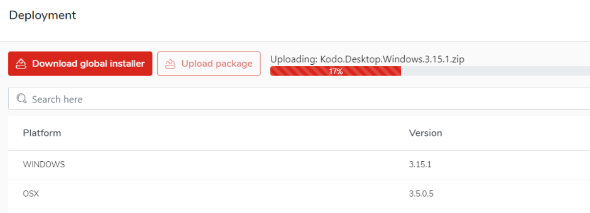

# KODO client deployment packages \(Admin Portal\)

To use the KODO client you first need to upload KODO client packages.

To get access to KODO client packages please contact with [Storware Professional Services Team](mailto:ps@storware.eu).

_TIP: If you are using KODO Server VA, client packages should be already available_

To upload client packages to your KODO Server follow the steps:

1. Click **Deployments** located in the left menu of the KODO Admin Portal, this will move you to KODO deployment page
2. Click the **Upload package** button, select downloaded client package and click **Open**
3. The package will be uploaded, after successful upload information will be displayed

