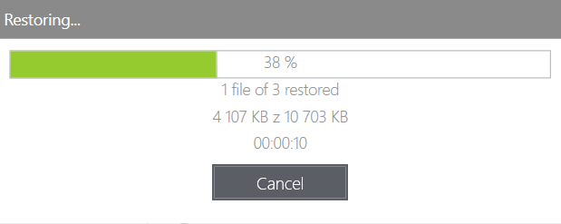

# Client console menu

## Overview

In the **Overview** view, the basic information about client settings and backup status is displayed:

1. Protection status and last backup \(synchronization\) time.
2. Assigned policy.
3. Continuous Data protection status.
4. The size of the backup data protected to date.


You can pause KODO for Endpoints client just by clicking "**Enabled**" and select one from the available options \(15 minutes, 1 hour, 4 hours, or until the next restart\).


In the **Backups** view, you can browse and recover protected files and folders. You also have a search window \(upper right corner of the window\) to find files by name or extension \(you can use the asterisk as well\).

To display all available file versions click the watch icon in the **Versions** column.

You can also use the time slider and the calendar to go to another "**point-in-time**" moment to restore the data you need.

In the **Settings** view you can set:

* **Server**- the IP or the name of the KODO for Endpoint server
* **Language** - you can choose the language Same as Microsoft Windows, English, Českỳ or Polski.
* **Maximum download speed \(kbps\)** 
* **Maximal download speed \(kbps\)**
* **Enable data encryption**- a user can set the password to encrypt backup \(the password will be required during the recovery process\).

If any previous backups are stored on the KODO server, existing backups will be deleted when encryption is enabled.

Set a password and confirm it. It takes a while to set up the password.

## Backups


KODO For Endpoints client will not backup zero-size files!


On this tab you can perform a restore of files from previous backups.

To restore files or files, just select the day and time of backup on the upper left corner

and then select a directory and/or file\(s\) to restore. You can restore whole directories instead of individual files too by checking up directories. After selection just click the **Restore** button and choose a restore location.

After all click one more time the **Restore** button.

If there is a conflict with an existing file, you can choose a restoring action:

* **Overwrite** - to overwrite all existing files that conflict with restore
* **Skip** - to skip restore of all conflicting files
* **Decide for each file** - decide what to do on every restored file
* **Cancel** - for cancel operation.

The operation may be canceled by clicking the **Cancel** button.

Click the **Done** button to finish. The restore process is finalized.

## Settings

On the Settings tab you can change server settings, interface language and turn on or off data encryption.

After changing values just click the **Save** button.

To restore previous values click the **Reset** button.

On this tab you can open thelogs folder for troubleshooting by clicking "_**Open Log folder**_" at the bottom right corner.

* To enable data encryption just check the box and confirm the warning message.


Enabling or disabling of encryption will erase all previously created backups!


And set encryption password.

After that backup will be encrypted.

* To disable encryption just unselect the checkbox, confirm the warning message and provide a previously set password.

