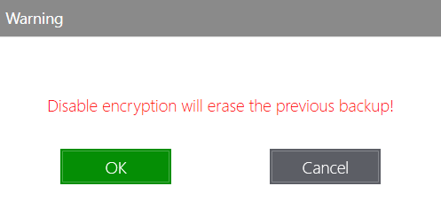

# Client settings

## Backups


KODO For Endpoints client will not backup zero-size files!


On this tab you can perform a restore of files from previous backups.

To restore files or files, just select the day and time of backup on the upper left corner

and then select a directory and/or file\(s\) to restore. You can restore whole directories instead of individual files too by checking up directories. After selection just click the **Restore** button and choose a restore location.

After all click one more time the **Restore** button.

If there is a conflict with an existing file, you can choose a restoring action:

* _**Overwrite**_ - to overwrite all existing files that conflict with restore
* _**Skip**_ ****- to skip restore of all conflicting files
* _**Decide for each file**_ - decide what to do on every restored file
* _**Cancel**_ - for cancel operation.

The operation may be canceled by clicking the **Cancel** button.

Click the **Done** button to finish.

The restore process is finalized.

## Settings

On the Settings tab you can change server settings, interface language and turn on or off data encryption.

After changing values just click the **Save** button.

To restore previous values click the **Reset** button.

On this tab you can open thelogs folder for troubleshooting by clicking "_Open Log folder_" on bottom right corner.

* To enable data encryption just check the box and confirm the warning message.


Enabling or disabling of encryption will erase all previously created backups!


And set encryption password.

After that backup will be encrypted.

* To disable encryption just unselect the checkbox, confirm the warning message and provide a previously set password.

