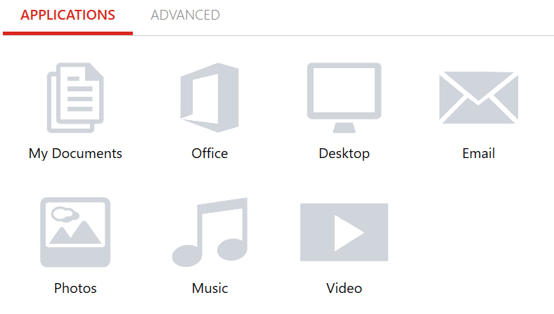
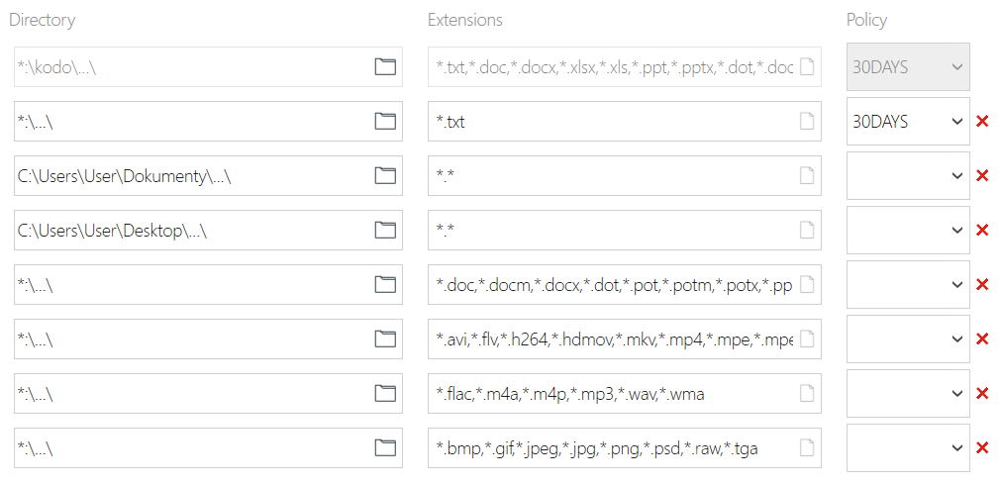

# Modifying backup policy

Users can change policy settings the endpoints are assigned to if the organization administrator allowed it in the policy settings \("**Allow user to modify policy**" option\). To check or edit the assigned policy just click the assigned policy name on the client console \(e.g. "Default"\)

For quick assigning just click the appropriate document type in the "**Applications**" tab.

* Click "**My Documents**" to add "**My Documents"** folder and subfolders to backup, i.e. "C:\Users\user\Documents...\"
* Selecting "Office" will add all office type documents \(**\*.doc, \*.docm, \*.docx, \*.dot, \*.pot, \*.potm, \*.potx,  \*.ppam, \*.pps, \*.ppsm, \*.ppsx, \*.ppt, \*.pptm, \*.pptx, \*.sldm, \*.sldx, \*.xla, \*.xlam, \*.xlm, \*.xls, \*.xlsb, \*.xlsm, \*.xlsx, \*.xlt, \*.xltx, \*.xlw** extentions\) on every disk on the endpoint.
* Select "**Desktop**" to add the desktop folder and all subfolders located on to backup.
* Select "**Email**" to add and schedule mailbox files for backup. **MS Outlook \(**PST format**\)** and **IBM Notes \(**NSF format**\)** are only supported.
* By selecting "**Photos**" all graphic files **\(\*.bmp, \*.gif, \*.jpeg, \*.jpg, \*.png, \*.psd, \*.raw, \*.tga** extentions\) on every disk on the endpoint will be included. 
* By selecting "**Music**" most common audio format files \(**\*.flac, \*.m4a, \*.m4p, \*.mp3, \*.wav, \*.wma**\) on every disk on the endpoint will be included.
* By selecting "**Video**" wmost common video format files \(\*.avi, \*.flv, \*.h264, \*.hdmov, \*.mkv, \*.mp4, \*.mpe, \*.mpeg, \*.mpeg1, \*.mpeg4, \*.mpg, \*.mpg2, \*.wmv, \*.xvid\) on every disk on the endpoint

  will be included.

Selected items will change colour to blue.

On the **Advanced** tab you have to select retention for every directory added for backup. Just scroll out the  "Policy" menu  and choose the policy.

\*.

There are the following preconfigured retentions to choose from: 7Days, 14Days, 30Days, 365Days and Nolimit.

You can add a directory manually to backup by clicking the "+**Add Include directory**" option and fulfilling _Directory_, _Extension,_ and _Policy_ fields.

To exclude some directories or/and file formats from the backup just choose the "**-Add Exclude Directory**" button and fill the _Directory_ and file _Extensions_ fields to exclude them from backup.

For directory recursion just use: "...\" wildcard in the directory field. Without this wildcard, the KODO client will exclude or include selected folders only, not subfolders.

