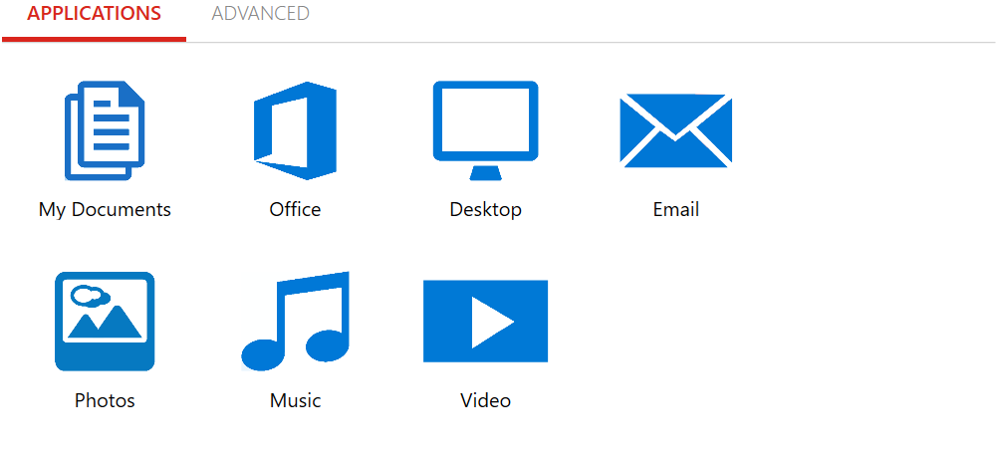

# Modifying backup policy

If you click the assigned policy name, you can modify the policy from the client console level. If in the policy settings \(at the **General** tab\) the **Allow user to modify policy** option is set to active, then you can choose the applications to be protected \(the extensions for Office, Photos, Music, Video files are included\), the locations \(My Documents and Desktop\) and email client archives \(MS Outlook and IBM Notes\).

For quick assigning just click the appropriate document type in the **Applications** tab.

* Select **My Documents** to add **My Documents** folder and subfolders to backup, i.e. "C:\Users\user\Documents...\"
* Select **Office** to add all office type documents \(**\*.doc, \*.docm, \*.docx, \*.dot, \*.pot, \*.potm, \*.potx,  \*.ppam, \*.pps, \*.ppsm, \*.ppsx, \*.ppt, \*.pptm, \*.pptx, \*.sldm, \*.sldx, \*.xla, \*.xlam, \*.xlm, \*.xls, \*.xlsb, \*.xlsm, \*.xlsx, \*.xlt, \*.xltx, \*.xlw** extentions\) on every disk on the endpoint.
* Select **Desktop** to add the desktop folder and all subfolders located on to backup.
* Select **Email** to add and schedule mailbox files for backup. **MS Outlook \(**PST format**\)** and **IBM Notes \(**NSF format**\)** are only supported.
* Select **Photos** all graphic files **\(\*.bmp, \*.gif, \*.jpeg, \*.jpg, \*.png, \*.psd, \*.raw, \*.tga** extentions\) on every disk on the endpoint will be included. 
* Select **Music** to add the most common audio format files \(**\*.flac, \*.m4a, \*.m4p, \*.mp3, \*.wav, \*.wma**\) on every disk on the endpoint will be included.
* Select  **Video** to add the most common video format files \(\*.avi, \*.flv, \*.h264, \*.hdmov, \*.mkv, \*.mp4, \*.mpe, \*.mpeg, \*.mpeg1, \*.mpeg4, \*.mpg, \*.mpg2, \*.wmv, \*.xvid\) on every disk on the endpoint will be included.

Selected items will change colour to blue.

In the **Advanced tab**, you can add the additional directory to be protected \(add file extensions and assign a policy by your choice\) by clicking the **Add Include Directory** button. For directory recursion just use: "...\" wildcard in the directory field. Without this wildcard, the KODO client will exclude or include selected folders only, not subfolders. The chosen directory can be deleted by clicking the "**x**" beside the entry.

To exclude some directories or/and file formats from the backup just choose the "**-Add Exclude Directory**" button and fill the _Directory_ and file _Extensions_ fields to exclude them from backup.

Click the **Save** button when finished editing.

