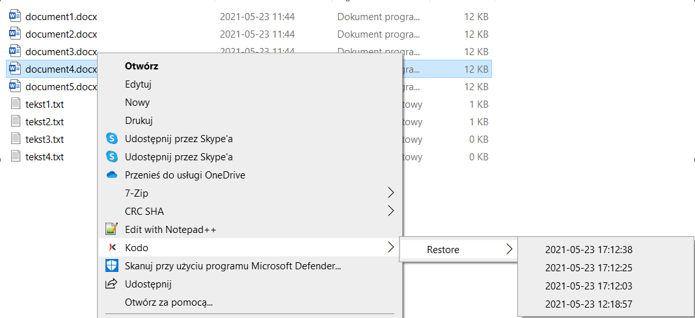

# Restoring files

An endpoint user can recover data using the following options:

* "right-click" mouse button context menu
* KODO client user console

## "Right-click" restore using the context menu

Leveraging "Continuous Data Protection" usability, every file in the protected directory will be backed up right after any change on it is made. This allows you to restore the file at the time the change was made \(if the file. To do this just click the right mouse button on the selected file and choose a file version to restore:

When you choose the file version, the action window will appear. You have two options to choose from:

* **Overwrite** - the existing file will be overwritten
* **Create Copy** - the file copy will be created with an additional timestamp the file was backed up \(e.g. KODO\_TEST\(20210801094730\).txt\) 

When the file is restored, click **OK** in the following window:

## Restoring previously deleted data using the dashboard

You can restore deleted data just by clicking the right mouse button in the protected directory and choose the **Restore** option.

This will open the KODO client user console where you can browse, select and restore data. If you check the box **Show deleted files**, the deleted files are shown.

All deleted files are is shown in red. You can choose an appropriate file and restore it as in [**UI usage**](client-settings.md) section.

