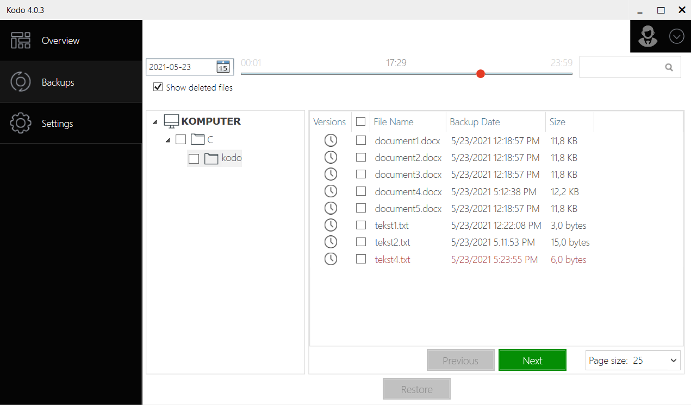
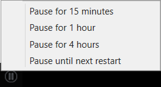
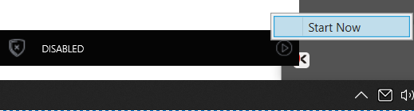

# Right mouse button

The Right mouse button is a very useful tool using with KODO client.

You can restore a file after deletion, restore file after every change and pause KODO client.

## Point in time restore

Because of Continuous Data Protection, every file in the selected directory will be backed up just after any change. This allows You to restore the file before every change is made within the retention period. To do this just click the right mouse button on the selected file and choose a file version to restore:

## Restore previously deleted file

You can restore deleted file just by clicking the right mouse button in the directory that file was located.

and choose the _Restore_ option. This will open GUI where you can restore deleted file from the previous backup by checking the box **Show deleted files.**

All deleted files are displayed in red colour. You can choose the proper file and restore it as in [**UI usage**](ui.md) section.

## Pause KODO client

You can pause the client, e.g. when you're using a mobile connection. To do this you have to find the KODO icon in the notification area on the Windows toolbar and click the right mouse button on it:

Then click the **Pause button**  and select the pause time from the menu. You can pause the client for 15 minutes, 1 hour, 4 hours or till the next system restart.

You can always start back by clicking right mouse button on KODO icon in the notification area and selecting  button and then _Start Now_

