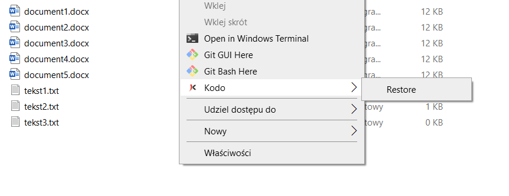

# Restoring files

An endpoint user can recover data using the following options:

* "Right-click" mouse button context menu
* KODO client user console

## "Right-click" restore using the context menu

Leveraging "Continuous Data Protection" usability, every file in the protected directory will be backed up right after any change on it is made. This allows you to restore the file at the time the change was made \(if the file. To do this just click the right mouse button on the selected file and choose a file version to restore:

When you choose the file version, the action window will appear. You have two options to choose from:

* **Overwrite** - the existing file will be overwritten
* **Create Copy** - the file copy will be created with an additional timestamp the file was backed up \(e.g. KODO\_TEST\(20210801094730\).txt\) 

When the file is restored, click **OK** in the following window:

## Restoring previously deleted data using the dashboard

You can restore deleted data just by clicking the right mouse button in the protected directory and choose the **Restore** option.

This will open the KODO client user console where you can browse, select and restore data. If you check the box **Show deleted files**, all deleted files are is shown in red. 

Once you've selected the data to recover, click the **Restore** button. Choose the restore location :

* Original Location
* Desktop
* Different Loction

Click the **Restore** button. If the encryption option was enabled, you will be asked for the password. If the recovered files exist in the restore location, the action window will appear.

You can choose one from the following options:;

* Overwrite
* Skip
* Decide for each file
* Cancel

If you've chosen **Decide for each file**,  then you have two more options:

* Overwrite
* Skip

When the restore process is accomplished, click the window by clicking the **Done** button.

