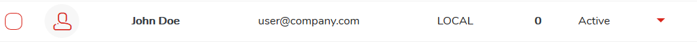

# Detailed user information

## Display user information

1. **Go to the list of users. Select** `Users` **from main menu**
2. **Click on the name of the user whose profile you want to view** 


You can also use Options menu "Details" item from user list


## Edit user account

1. **Go to the list of users. Select** `Users` **from main menu**
2. **Click on the name of the user you want to edit**
3. **Click**  **button**

Edit selected fields and confirm your changes by clicking  button


You can also use Options menu "Edit" item from user list



**You can only edit local user accounts.**


## Lock/unlock user account

Locking account will result in blocking access to account and data by the user

To lock/unlock user account:

1. **Go to the list of users. Select** `Users` **from main menu**
2. **Click on the name of the user you want to lock or unlock**
3. **Click the**  **button, select** `Lock user` **or if user was previously locked** `Unlock user`

## Delete user account and backup data


**Deleting a user from the system will result in the deletion of all his devices and data**


1. **Go to the list of users. Select** `Users` **from main menu**
2. **Click on the name of the user you want to delete**
3. **Click**  **button**


**You can only delete local user accounts.**


