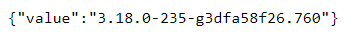

# Common tasks

## Server communication error

Check if the server component is working \(kodo-for-endpoints\).

You can check the status using this command:

  
`/opt/storware/kodo-server/api-core/bin/status.sh`

### Check if firewall doesn't block connections

Check if firewall \(global/on workstation/on server\) doesn't block connections to api-core component, default port: 8181.

### Check if workstation has connection to address configured in Web Admin UI component

Check if workstation used to connect with portal has access to address \(IP or FQDN\) configured in `/opt/storware/kodo-server/web-admin-ui/conf/env.json` file.

You can check this usgin a web browser, provide api-core component address to test connection:  
`https://api-core-address:8181/api/version`

Version of installed component should be displayed.

