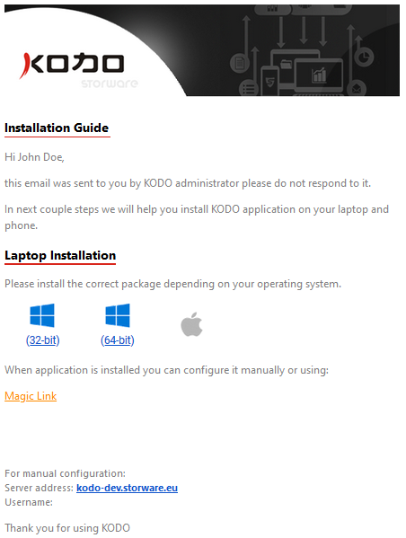

# Deployment email

The organization administrator can send the deployment email to selected users. The e-mail a user receives looks like the one below. It contains the download links to the KODO client installer packages and the "Magic Link". Allows the user to automatically log in to the KODO server without having to enter a password.

To send the KODO client installation guide by e-mail message, go to the **Users** view at **KODO Organization Portal** and select a user or users you want to sent the e-mail to. Choose the "**Deploy Client**" from the **Options** menu. Alternatively, you can click the "**Deploy Client**" button. 

It will send a KODO client installation guide for the selected platform type.

The e-mail a user receives looks like the one below. It contains the download links to the KODO client installer packages and the "Magic Link". It will be explained in the next section how to use it to automatically log in the user to the KODO server.


To send a single message containing download links and instructions for multiple users simultaneously, just select the check box next to all selected usernames and then click the **Deploy Client** button in the upper right corner.


