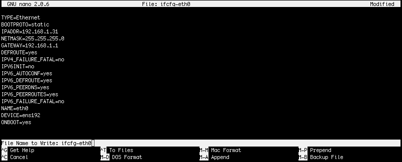

# Setting up the network configuration

The next step is to configure the network connection. To do this you will need to edit the network configuration file. The default configuration will try to assign an IP address from local DHCP if exits.

Use `sudo` command to run a shell with root privileges:

```text
$ sudo -s
```

When asked for a password use password for kodo user.

Edit network configuration file:

```text
# nano /etc/sysconfig/netork-scripts/ifcfg-ens160
```

To set up static IP address change:

```text
BOOTPROTO=dhcp
```

to

```text
BOOTPROTO=static
```

Next, uncomment \(delete the `#` character\) the following options:

* IPADDR=YOUR\_IP\_ADDRESS
* NETMASK=YOUR\_NETMASK
* GATEWAY=YOUR\_GATEWAY

and change them accordingly to your requirements.

**IPADDR** - IP address of the KODO Server  
**NETMASK** - netmask value of your network  
**GATEWAY** - gateway value of your network

Sample configuration file:

```text
TYPE=Ethernet
BOOTPROTO=static
IPADDR=192.168.1.31
NETMASK=255.255.255.0
GATEWAY=192.168.1.1
DEFROUTE=yes
IPV4_FAILURE_FATAL=no
IPV6INIT=no
IPV6_AUTOCONF=yes
IPV6_DEFROUTE=yes
IPV6_PEERDNS=yes
IPV6_PEERROUTES=yes
IPV6_FAILURE_FATAL=no
NAME=eth0
DEVICE=ens192
ONBOOT=yes
```

Save the file pressing the `CTRL+o` and then `Enter` key.



After the file is saved you can exit the editor by pressing `CTRL+x` key combination.

The final step is to restart the network configuration. To do this use the command:

```text
# service network restart
```

Now you should be able to log in to your KODO system using a web browser and IP address that you configured in previous steps. Open a  web browser and enter:

```text
https://ip_address:8181
```

KODO login page should be opened.


KODO server is ready to be configured. Go to the [Configuration](../../configuration/) chapter to start server setup or go to the next chapter. 


KODO for Endpoints server has no license uploaded. Please contact [Storware sales team](mailto:sales@storware.eu) to get a trial license.  


