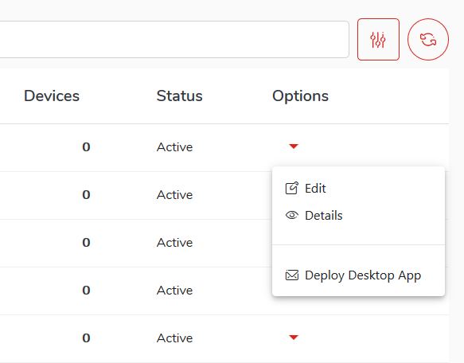
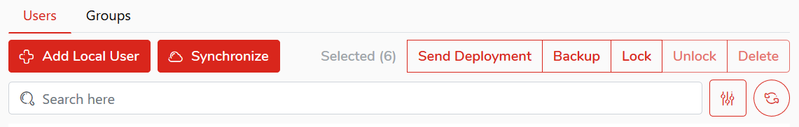

# Sending installation instructions (KODO Organization Portal)

To send KODO client installation instructions, select `Users` from the main menu of the `KODO Organization Portal` and then click the arrow to the right of the table on the line with the device whose data you want to display select `Deploy Desktop App` from the menu.

You will be sent a KODO client installation instruction for the selected platform type.

)


**The email will include both, Windows and OS X client packages.**


_To send a single message containing download links and instructions for multiple users simultaneously, just select check box next to all selected usernames and then click `Send Deployment` button in upper right corner._


