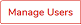

# Detailed policy information

## Display policy configuration 

1. **Go to the list of policies. Select** `Policy` **from main menu**
2. **Click on the name of the policy which configuration you want to display**

In [Policy configuration](https://github.com/Storware/kodo-endpoints-manual/tree/4aaf7963e8bd360acf364257fa025561f954a699/management/data-protection-management/policy-configuration.md) chapter you will find detailed information about individual options

## Edit policy configuration 

1. **Go to the list of policies. Select** `Policies` **from main menu**
2. **Click on the name of the policy you want to edit**
3. **Click**  **button**
4. \*\*Edit selected options and confirm your changes by clicking 

    button. button located on rightbottom of the page.\*\*

You can also use Quick Action menu "Edit" item from policy list

## Assign users to policy

1. **Go to the list of policies. Select** `Policies` **from main menu**
2. **Click on the name of the policy you want to edit**
3. **Click**  **button**
4. **Assign users to policy by clicking checkboxes on left side**
5. **Confirm changes by clicking**  **button.**

