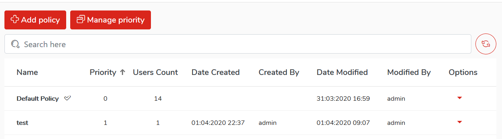
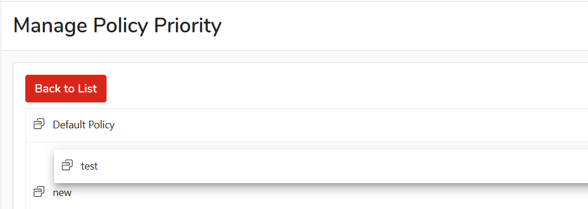

# Policies list

## List polices 

A list will display all policies configured in system

To view the list of polices, select `Policies` from the main menu. 

Policies list table view consist of following columns:

| **Field** | **Description** |
| :--- | :--- |
| Name | Name of policy |
| Priority | Priority \(see below\) |
| Users count | Numer of users associated with policy |
| Date created | Creation date of policy |
| Created by | Who created policy |
| Date modified | When policy was modified last time |
| Modified by | Who modified policy |
| Options | Options menu |

## Default policy 

 Default policy will be used for all new users synced from external source, like e.g. Active Directory.

## Priority 

When user belong to group, group policy will be applied. In case when user belongs to many groups, priority will determine which policy will be applied.

The higher priority, the more important the policy is

To modify policy priorities, go to the list of policies and then click on `Manage Priority`

Grab the selected policy and move \(grab and drop\) it to the selected position. The higher the policy is, the higher priority will be assigned. Grab policy and move it around the list

