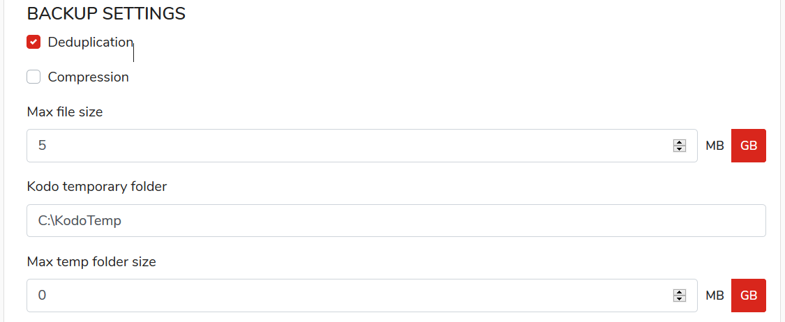
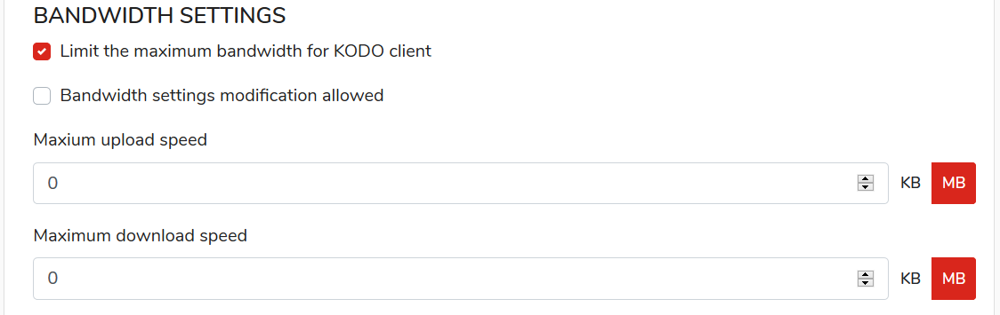
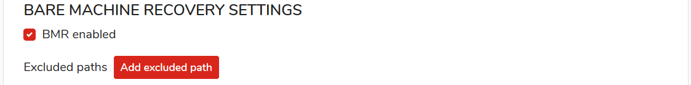
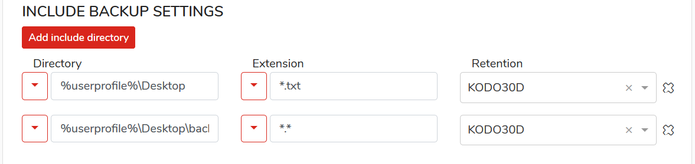
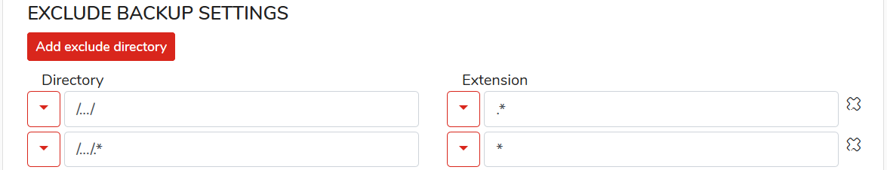

# Windows ans MacOS protection

## **BASIC SETTINGS** 

**Deduplication**  
Turn on or off client-side data deduplication

**Compression**  
Turn on or off client-side data compression

**Max file size \[MB/GB\]**  
Max. protected file size, files larger than the specified size will be omitted during backup process

**Kodo temporary folder**  
Path to folder used by KODO for temporary backup space

**Max temp folder size \[MB/GB\]** (_Windows only_)
Maximum size of KODO temporary folder.

**Force automatic client update**

## **BANDWIDTH SETTINGS** (_Windows only_)

**Limit the maximum bandwidth for KODO client**  
Setup maximum bandwidth used to transfer backup by KODO client

**Bandwidth settings modification allowed**

**Maximum upload speed**
Set maximum outbound bandwidth for KODO client

**Maximum download speed**
Set maximum inbound bandwidth for KODO client

## **BARE MACHINE RECOVERY SETTINGS** (_Windows only_)

This backup options allows you to restore from scratch on new installed machine

**Exclude paths**
Exclude custom directories from BMR backup

## **INCLUDE BACKUP SETTINGS** 

A section defining which paths and file extensions should be protected in continuous data protection mode.

**DIRECTORY**  
Directory path to be protected in Continuous Data Protection mode 

**EXTENSIONS**  
Extensions of files that should be protected in selected path

**RETENTION**  
Data retention for protected data, how long backup data should be kept on KODO for Endpoint server

## **EXCLUDE BACKUP SETTINGS** 

A section defining which paths and file extensions should be excluded from data protection process.


_Exclude settings are **stronger** than include_


The list is displayed as a table with the following columns:

**DIRECTORY**  
Path to be excluded from protection

**EXTENSIONS**  
File extensions to be excluded from protection

