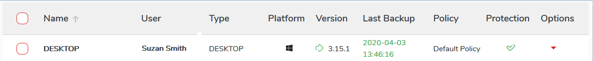
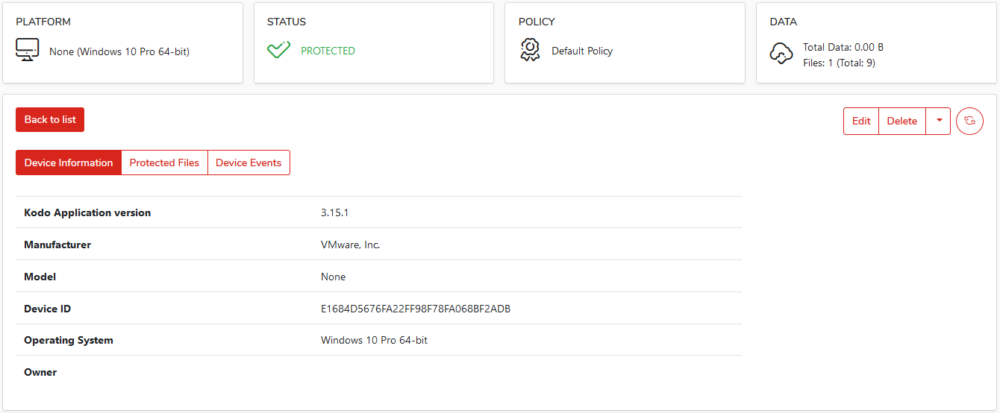
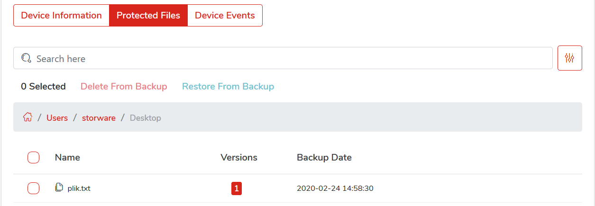

# Detailed device information

To view details about the device, select `Devices` from the main menu and then:

* Click the device name from the available list

  ​​

or

* Click the arrow icon from the table **Options menu and select `Details` from the menu.

  

## Details

* **Device information** - Informations about registerd device ie: app version, operating system, manufacturer.

* **Protected Files** - Backup browser allows administrator to restore files from backup when [policy](../data-protection-management/general-settings.md) allows it, and option: _Allow administrators to restore user files_ is turned on.

* **Device Events** - Device event log.