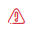

# Device status

Each device registered in the system has a suitable status defining its current state.

Possible device status in the system:

* **Protected**   Status presented with a green V symbol. Indicates that the device is active and that the device's last communication time did not exceed the value given in the policy assigned to the device owner.
* **Not protected**   Status represented by the red triangle icon. Indicates that the device is active, but the last communication time of the device has exceeded the value specified in the policy assigned to the device owner.
* **Locked**   Status presented with a red padlock icon. Indicates that the device is locked and cannot login.

