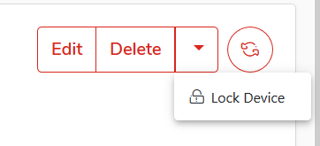
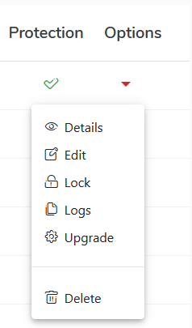
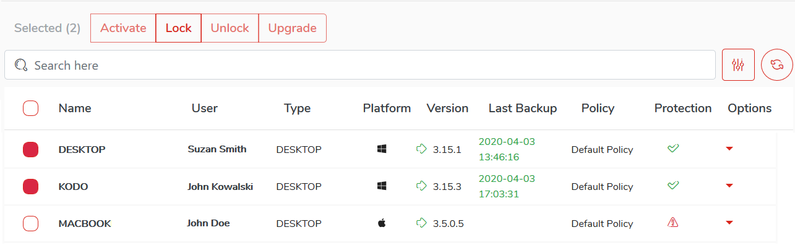
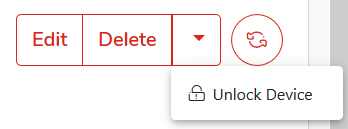
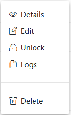
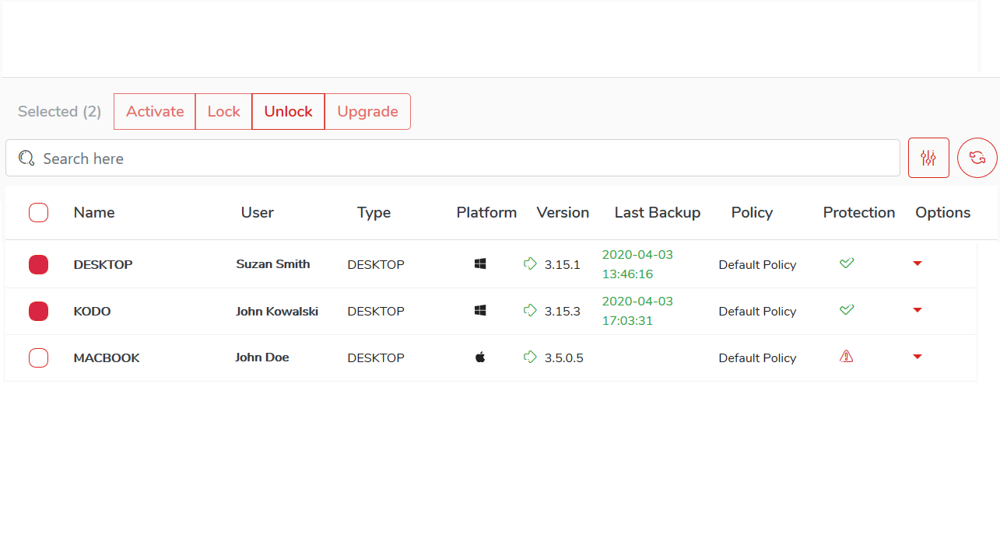

# Locking device

To lock device and prevent user from logging in to system, select `Devices` from the main menu and:

* Click the device name from the available list, click the  drop-down menu button and select `Lock Device`

  
  
or

* Click on the arrow to the right of the table on the line with the device whose data you want to display select `Lock` from the `Options` menu.

or 

* Select the selectbox next to desired devices and then click_ `Lock` _button located at the top of device list. In this way you can lock multiple devices at once.

# Unlocking device

To unlock the device and allow the user to login from it select `Devices` from the main menu and:
* Click the device name from the available list, click the  drop-down menu button and select `Unlock Device`

  
  
or

* Click on the arrow to the right of the table on the line with the device whose data you want to display select `Unlock` from the `Options` menu.

or

* Select the selectbox next to desired devices and then click_ `Unlock` _button located at the top of device list. In this way you can unlock multiple devices at once.

