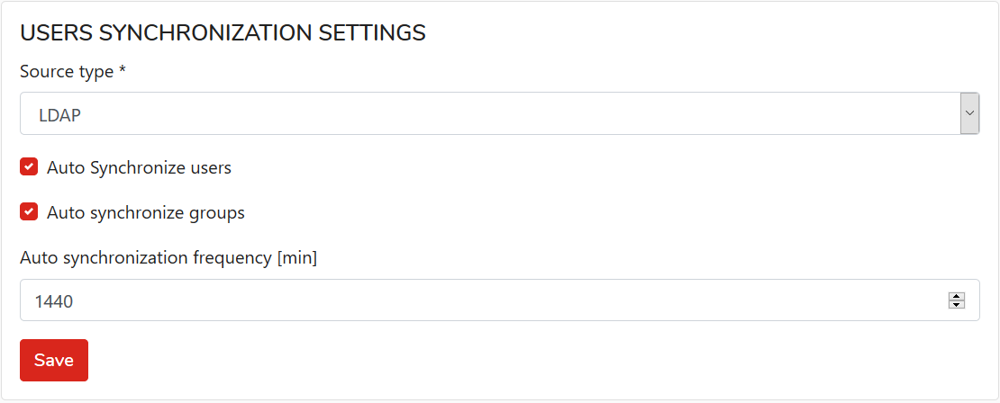

# Sync users with LDAP

## Configure connection with LDAP server with KODO Organization Admin Portal

1. **Go to settings by clicking Settings in the main menu**
2. **Go to the LDAP tab**

Provide necessary information:

* **Server URL -** directory server ip or domain address
* **Login -** username used for synchronization
* **Username format -** username and domain format used in LDAP
* **Search -** directory service search filter
* **Group filter -** LDAP group filter


If you configuring synchronization for the first time before clicking the  button fill the LDAP user password fields.


Click on the button to confirm your changes.

## Configure users synchronization source

1. **Go to settings by clicking on Settings in the main menu**
2. **Go to tab** `Users Synchronization`

   

3. **As source of synchronization \(**`Source type` **\) select:** `LDAP`
4. **Mark the Auto Synchronize users checkbox**
5. **Set Auto synchronization frequency \[min\]  \(0 - no synchronization\)**
6. **Save changes with**  button.

